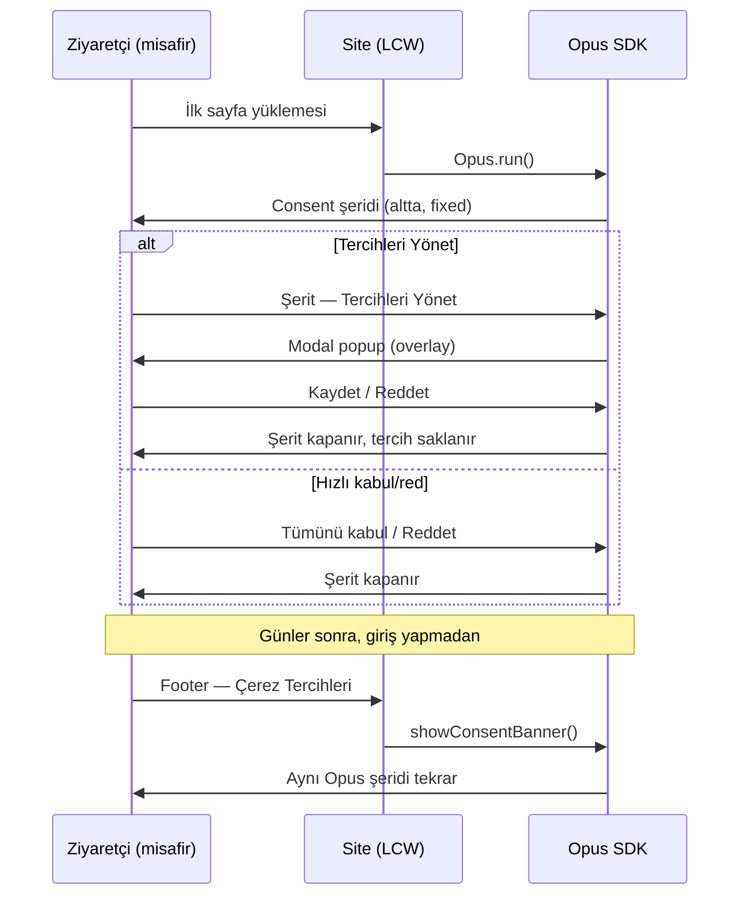

# Çerez / Consent Uyumluluğu — Zorunlu Standart

**İş kodu:** MD-012 (P0)  
**Durum:** Opus SDK + LCW referans entegrasyonu uygulandı (2026-05-21)  
**Kapsam:** Opus SDK kullanan tüm web vitrinleri (LCW mockup, gelecekteki üretim siteleri)

---

## Yasal zorunluluk (Master Development politikası)

Avrupa GDPR / ePrivacy ve Türkiye KVKK çerçevesinde, **çerez ve benzeri izleme teknolojileri için verilen rıza**:

1. **Her zaman geri alınabilir ve güncellenebilir olmalıdır.** Kullanıcı, bir kez tercih yaptıktan sonra dilediği zaman bu tercihleri değiştirebilmelidir (GDPR md. 7(3) — rızanın geri çekilmesi en az rıza vermek kadar kolay olmalıdır).
2. **Üyelik veya giriş şart değildir.** Consent akışı misafir (anonim) ziyaretçiler için de geçerlidir. Kullanıcının sisteme kayıtlı olması, tercihlerini yönetebilmesi için **gerekli değildir**.
3. **Tek kaynak Opus consent modülüdür.** Site tarafında ayrı bir çerez banner’ı, simülasyonu veya “Tercihleri Yönet” paneli **üretilmez**. Metin, tema, kategoriler ve davranış Opus bootstrap / admin yapılandırmasından gelir.
4. **Kalıcı erişim noktası zorunludur.** Footer veya eşdeğer bir “Çerez Tercihleri” bağlantısı, kullanıcının istediği an consent arayüzüne dönmesini sağlamalıdır.
5. **Modal yalnızca bilinçli eylemle açılır.** Detaylı kategori tercihleri (performans, pazarlama, fonksiyonel) popup/modal olarak gösterilir; sayfa akışına gömülü inline panel **kabul edilmez**. Modal, şerit üzerindeki “Tercihleri Yönet” (veya eşdeğeri) tıklanmadan açılmamalıdır.

Bu maddeler Master Development altındaki tüm Opus entegrasyonları için **bloklayıcı gereksinim**dir; MD-001 ve MD-011 kapsamındaki vitrinler buna uymalıdır.

---

## Teknik mimari

### Kimlik (üyelik gerekmez)

| Kavram | Depolama | Açıklama |
|--------|----------|----------|
| Anonim ziyaretçi | `localStorage.opus_anon` | SDK tarafından atanır; consent bu cihaz/tarayıcı oturumuna bağlanır |
| Consent kaydı | `localStorage.opus_cookie_consent_{siteKey}` | Kategori tercihleri + `decidedAt` |
| Giriş yapmış kullanıcı | Opus `identify()` | Opsiyonel; consent **girişe bağlı değildir**, anonim kayıt geçerlidir |

### Opus SDK API (tek doğru yol)

| API | Ne zaman | Davranış |
|-----|----------|----------|
| `Opus.run()` → `OpusConsent.ensureDecided()` | İlk ziyaret, henüz karar yok | Altta sabit **Opus consent şeridi** |
| `Opus.showConsentBanner()` | Footer / “Çerez tercihleri” tıklaması | Aynı şerit **tekrar** gösterilir (önceki karar olsa bile) |
| `Opus.showConsentPreferences()` | Doğrudan tercih merkezi (opsiyonel) | Yalnızca **modal overlay**; şerit olmadan da çağrılabilir |
| `Opus.getCookieConsent()` | Okuma | Mevcut kategori tercihlerini döner |

Şerit üzerinde “Tercihleri Yönet” → Opus iç akışı `renderModal()` (fixed overlay, `#opus-consent-modal`).

**Kaynak:** `Opus/packages/sdk/src/opus-consent.js`, `opus.js`  
**Dağıtım:** `npm run build` → `packages/sdk/dist/` — Opus API `/sdk/*` üzerinden sunulur.

### Site entegrasyonu (LCW referans)

```javascript
// Footer — çerez şeridini yeniden aç
window.Opus?.showConsentBanner?.();

// İnce sarmalayıcı (LCW)
import { showOpusConsentBanner } from '@/lib/opus';
<a href="#" onClick={showOpusConsentBanner}>Çerez Tercihleri</a>
```

**Yasak:** `CookieBanner`, `CookieConsentContext`, site-özel `localStorage` consent anahtarları (`lcw-cookies` vb.), şerit + Opus modal’ın aynı anda gösterilmesi.

---

## Kullanıcı akışı (kabul kriteri)



---

## Proje bazlı uygulama checklist

### Opus (`MD-012 sahibi)

- [x] `OpusConsent.showBanner(ctx)` — şerit yeniden tetikleme
- [x] `Opus.showConsentBanner()` — public API
- [x] `showPreferences()` — stil enjeksiyonu (modal fixed konum)
- [ ] Admin: consent metin/tema/kategori yönetimi dokümante (bootstrap `consent` alanı)
- [ ] `cookie_consent_updated` event raporlama doğrulaması

### LCW mockup (`MD-001 / MD-011`)

- [x] Özel çerez banner kaldırıldı
- [x] Footer → `Opus.showConsentBanner()`
- [ ] Test matrisi T7 (aşağıda) → `SCAN_LOG`

### Gelecek vitrinler (Next.js / üretim)

- [ ] Opus SDK layout’ta yüklenir; **site consent UI yok**
- [ ] Footer / gizlilik politikası sayfasında kalıcı “Çerez tercihleri” linki
- [ ] Hard refresh sonrası footer tıklaması şeridi açar (SDK + API ayakta)

---

## Test matrisi (MD-012)

| # | Senaryo | Önkoşul | Beklenen |
|---|---------|---------|----------|
| T7a | İlk ziyaret | Consent localStorage temiz | Opus şeridi altta; site banner’ı yok |
| T7b | Tercihleri Yönet | T7a | Modal overlay; sayfa gövdesine gömülü panel yok |
| T7c | Karar sonrası footer | Accept/reject yapılmış, **giriş yok** | Footer → şerit tekrar açılır |
| T7d | Tercih güncelleme | T7c → Tercihleri Yönet → kategori değiştir | `getCookieConsent()` güncellenir |
| T7e | Push / pazarlama | Marketing reddedilmiş | `enablePush()` marketing gerekliyse reddedilir |

---

## İlgili belgeler

| Belge | İlişki |
|-------|--------|
| [`OPUS_LCW_INTEGRATION.md`](OPUS_LCW_INTEGRATION.md) | MD-001 — Opus genel entegrasyon |
| [`IDENTITY_LINKING.md`](IDENTITY_LINKING.md) | `opus_guid`, `consent_records` |
| [`LCW_NEXTJS_HEADLESS.md`](LCW_NEXTJS_HEADLESS.md) | MD-011 — Next.js taşıma |
| `lcw/lib/opus.js` | `showOpusConsentBanner()` sarmalayıcı |

---

## Özet (agent / geliştirici)

> **Consent, Opus’un sorumluluğundadır.** Site yalnızca SDK’yı yükler ve kullanıcıya tekrar erişim linki verir. Misafir kullanıcı, bir kez consent akışına girdikten sonra footer (veya eşdeğeri) ile istediği an tercihlerini kolayca yeniden düzenleyebilmelidir — üye olması gerekmez.
