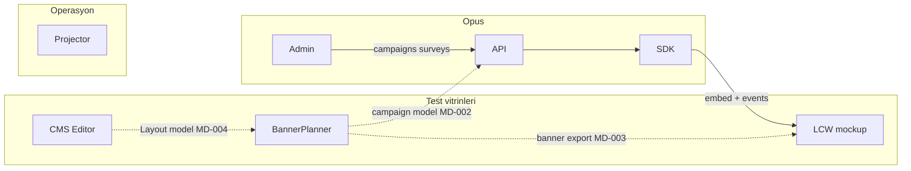

# Integration Map

Projeler arası teknik ilişkiler ve koordinasyon adımları.

## 1) Opus → LCW mockup (P0)

| Alan | Detay |
|------|--------|
| Amaç | Opus özelliklerini gerçeğe yakın vitrinde test |
| Yöntem | SDK script, `opus.track`, sepet kancaları |
| Rehber | [`OPUS_LCW_INTEGRATION.md`](OPUS_LCW_INTEGRATION.md) |
| Kapanış | LCW test matrisi T1–T6 + SCAN_LOG kaydı |
| Durum | **Entegrasyon bekliyor** (LCW'de opus referansı yok) |

## 2) Opus ↔ BannerPlanner (P2)

| Alan | Detay |
|------|--------|
| Amaç | Banner planlama ile Opus campaign şeması uyumu |
| Yöntem | Alan eşleme tablosu; uyumsuzluk → WORK_QUEUE |
| Referans | `Opus/apps/admin/public/schema.opus.json` |
| İş kodu | MD-002 |

## 3) BannerPlanner → LCW mockup (P1)

| Alan | Detay |
|------|--------|
| Amaç | Planlanan banner/hero içeriğinin LCW vitrinde görsel doğrulaması |
| Yöntem | JSON export → LCW `banner-feed` (planlı) |
| Rehber | [`BANNER_LCW_INTEGRATION.md`](BANNER_LCW_INTEGRATION.md) |
| Agent günlükleri | [`BannerPlanner/AGENT_SYNC.md`](../BannerPlanner/AGENT_SYNC.md), [`lcw/AGENT_SYNC.md`](../lcw/AGENT_SYNC.md) |
| İş kodu | MD-003 |
| Durum | **Planlama** — otomatik import yok |

## 5) CMS ↔ BannerPlanner Layout modeli (P2)

| Alan | Detay |
|------|--------|
| Amaç | CMS HomePage entity'sini Layout omurgasına birleştirmek |
| Yöntem | `ViewAssignment` + `layouts.json` alan eşlemesi |
| Rehber | [`CMS_HOME_LAYOUT_UNIFICATION.md`](CMS_HOME_LAYOUT_UNIFICATION.md) |
| Agent günlükleri | [`CMS/AGENT_SYNC.md`](../CMS/AGENT_SYNC.md) |
| İş kodu | MD-004 |
| Paralellik | **MD-003 bloklanmaz** — BannerPlanner öncelikli ilerleyebilir |
| Durum | **Planlama** |

## 7) Content Publish Contract — BannerPlanner → CMS (MD-007)

| Alan | Detay |
|------|--------|
| Amaç | Planlama → üretim tek JSON sözleşmesi; component/item ölçümü |
| CMS önkoşul | Faz 1 ✅ Homepage / Template / ComponentPayload |
| Rehber | [`CONTENT_PUBLISH_CONTRACT.md`](CONTENT_PUBLISH_CONTRACT.md) |
| Paralel | MD-003, MD-004, MD-005 |
| Durum | **Şema yazıldı** — export/import bekliyor |

## 8) Lokalizasyon ortaklaştırma — Backoffice Mobile → CMS (MD-010)

| Alan | Detay |
|------|--------|
| Amaç | Mobile lokalizasyon + Web bağımsız süreci CMS ortak DB omurgasında birleştirmek |
| Gerekçe | Backoffice ülke DB ayrımı vs CMS ortak DB; çift kaynak operasyon yükü |
| Rehber | [`LOCALIZATION_CMS_UNIFICATION.md`](LOCALIZATION_CMS_UNIFICATION.md) |
| Paralel | MD-004 locale UX; MD-007 cultureKey; MD-003 bloklanmaz |
| Durum | **Planlama** — toplantı kararı 2026-05 |

## 9) LCW Next.js headless + CMS API (MD-011)

| Alan | Detay |
|------|--------|
| Amaç | LCW mockup Next.js; CMS menü/homepage API; üretim mimarisine yakın vitrin |
| Hedef zincir | BannerPlanner → CMS (MD-007) → LCW Next.js — etki gözlemi |
| Rehber | [`LCW_NEXTJS_HEADLESS.md`](LCW_NEXTJS_HEADLESS.md) · [`CMS_READ_API.md`](CMS_READ_API.md) |
| Paralel | MD-001/003 kısa vade; MD-004/007/010 ile hizalı |
| Durum | **Faz 1–2 hazır** — menü+page bundle API + LCW tüketim; BP gözlem / cutover bekliyor |

## 12) Ürün kişiselleştirme CMS → LCW (MD-015)

| Alan | Detay |
|------|--------|
| Amaç | Zone/mm enrichment CMS’de; listing + PDP modal LCW’de |
| API | `GET /api/v1/content/personalization*` (CMS :3458) |
| LCW | `lib/cms-personalization.js` · `/[market]/kisisellestirilebilir` |
| Rehber | `CMS/docs/personalization-*.md` · `lcw/docs/cms-personalization.md` |
| EPIM | Uzun vadede master veri — sınır: [`EPIM_CMS_BOUNDARY.md`](EPIM_CMS_BOUNDARY.md) (MD-016) |
| Durum | **Simülasyon + API + LCW tüketim hazır** — UAT / EPIM sync bekliyor |

## 13) EPIM ↔ CMS kategori / menü sınırı (MD-016)

| Alan | Detay |
|------|--------|
| Amaç | Taksonomi EPIM tek kaynak; menü/navigasyon CMS; `CategoryId` / `t-{id}` bağ |
| Rehber | [`EPIM_CMS_BOUNDARY.md`](EPIM_CMS_BOUNDARY.md) |
| Durum | **Doküman yazıldı** — ekip onayı bekleniyor |

## 6) shared/opus-client → CMS preview (MD-006)

| Alan | Detay |
|------|--------|
| Amaç | Opus SDK’yı CMS Layout editöründe test etmek |
| Site key | `cms_editor_dev_key` |
| Yol | `C:\web\shared\opus-client` |
| Opus talep | MD-005 site bazlı gezinti raporu — [`Opus/AGENT_SYNC.md`](../Opus/AGENT_SYNC.md) |
| Durum | **CMS entegrasyon tamam** — Admin raporu bekliyor |

## 11) Opus Omni Postcheckout (MD-014)

| Alan | Detay |
|------|--------|
| Amaç | Sipariş sonrası SMS/Push → OTP → modüler postcheckout (anket, sipariş, fatura, QR) |
| Opus rol | Domain SPA, OTP/BFF, survey inline, trigger link |
| Dış bağımlılık | Fulfilment omni order · Customer CRM/üyelik · EComAI kombin |
| Rehber | [`OPUS_OMNI_POSTCHECKOUT.md`](OPUS_OMNI_POSTCHECKOUT.md) |
| Sahip | Customer Engagement (Ersel UI, Emre Backend) |
| Durum | **Planlama** — Faz 0 workshop |

## Koordinasyon kuralları

1. Çoklu projeyi etkileyen değişiklik → aynı gün `WORK_QUEUE` maddesi.
2. Kapanış = kaynak proje + **etkilenen projede doğrulama**.
3. Opus SDK/API değişikliği → LCW testi varsayılan kapanış adımı.
4. Belirsiz etki → SCAN_LOG'a "inceleme gerekli", P1 madde.
