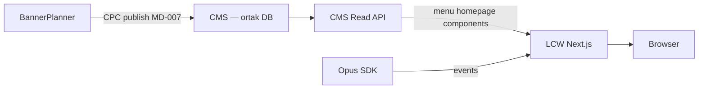

# LCW Next.js Headless Vitrin — CMS API Tüketimi

**İş kodu:** MD-011 (P1)  
**Durum:** **Devam ediyor** — Menü Read API Faz 1 uygulandı  
**Rehber:** [`CMS_READ_API.md`](CMS_READ_API.md)  
**Bağlam:** Kurumsal hedef — Web altyapısı klasik MVC → **Next.js headless** mimari

---

## Stratejik hedef

1. **LCW mockup’ı Next.js ile yenilemek** — deneyim kazanmak ve üretim geçişine hazırlık  
2. **CMS verisini API ile LCW katmanına çekmek** — önce **menü**, ardından **homepage** ve component verileri  
3. **Üretim mimarisine yakın simülasyon** — CMS = system of record, LCW = sunum katmanı  
4. **BannerPlanner → CMS entegrasyonu sonrası etkiyi gözlemlemek** — planlama → CMS publish → LCW render hattının uçtan uca doğrulanması

## Neden LCW ile başlamak?

| Gerekçe | Açıklama |
|---------|----------|
| Düşük risk vitrin | Statik mockup zaten test ortamı; Next.js öğrenme maliyeti üretimi bloklamaz |
| Mevcut entegrasyonlar | Opus (MD-001), BannerPlanner (MD-003) hatları burada doğrulanıyor |
| CMS hazırlığı | MD-004 Faz 1, MD-007 CPC — CMS’te veri omurgası oluşuyor |
| Gözlem değeri | BP → CMS → LCW zinciri kurulunca BannerPlanner çalışmasının vitrin etkisi net görülür |

## Hedef mimari (üretime yakın)

**Mevcut (geçiş öncesi):** Statik HTML + JSON export (`banner-export.json`) — MD-003  
**Hedef:** Next.js `fetch`/SSR/ISR + CMS API sözleşmesi

---

## Faz planı

### Faz 0 — Mevcut durum (referans)

| Katman | Teknoloji | Koordinasyon |
|--------|-----------|--------------|
| LCW | Statik HTML, `node server.js` :3000 | MD-001, MD-003 |
| CMS | Simülasyon SPA, seed JSON | MD-004, MD-007 |
| BannerPlanner | Planlama → JSON export (hedef) | MD-003, MD-007 |

### Faz 1 — LCW Next.js bootstrap (P1)

- [x] Next.js App Router iskelet (`lcw/app/`)
- [x] Mevcut sayfa seti parity: ana sayfa, kadın/erkek, header/footer
- [ ] Opus SDK entegrasyonu taşınması (MD-001 kuralları korunur)
- [ ] Dev port envanteri (ör. **3000** Next dev, statik mockup geçici **3001**)

**Çıkış:** Next.js vitrin yerel çalışır; görsel parity statik mockup ile kabul edilebilir seviyede.

### Faz 2 — CMS Read API (menü öncelikli) (P1)

- [x] CMS menü seed → API (`GET /api/v1/content/menus/:cc/:lang`, `CMS_READ_API.md`)
- [x] LCW: konfigüratif menü tüketimi + yerel fallback (`lib/cms-config.js`, `lib/menu.js`)
- [ ] Locale: market slug → `countryCode` + `langCode` eşlemesi (MD-010)

**Çıkış:** LCW navigasyonu CMS API'den gelir (opsiyonel); kapalıyken statik JSON.

### Faz 3 — Homepage + component API (P1)

- [x] CMS Homepage → Template → Component Read API + page bundle (`CMS_READ_API.md`)
- [ ] LCW ana sayfa hero / slot render — CMS → `LcwBanners` HTML projection
- [ ] Opus `content_impression` / `content_click` (MD-007 ölçüm)

**Çıkış:** Ana sayfa vitrin CMS verisi ile render; MD-003 JSON export yolu isteğe bağlı fallback.

### Faz 4 — BannerPlanner → CMS → LCW gözlem (P1)

- [ ] BannerPlanner `exportCpc()` → CMS import (MD-007)
- [ ] LCW Next.js CMS API’den güncel planlanmış içeriği gösterir
- [ ] BannerPlanner ekibi vitrin etkisini mockup’ta doğrular

**Çıkış:** Planlama değişikliği → CMS publish → LCW’de görünür (üretim hattına en yakın simülasyon).

---

## API sözleşmesi

| Endpoint | CMS kaynağı | LCW kullanımı | Durum |
|----------|-------------|---------------|--------|
| `GET /api/v1/content/menus/:cc/:lang?format=vitrin` | `menu-trees/` | Header/nav | ✅ Faz 1 |
| `GET /api/v1/content/homepages` | Homepage records | Sayfa omurgası | Planlı |
| `GET /api/v1/content/components/:id` | Component + items JSON | Hero, slider | Planlı |

Detay: [`CMS_READ_API.md`](CMS_READ_API.md)

CPC v1 alanları: [`CONTENT_PUBLISH_CONTRACT.md`](CONTENT_PUBLISH_CONTRACT.md)

---

## İlişkili iş kodları

| Kod | İlişki |
|-----|--------|
| MD-001 | Opus SDK Next.js layout’a taşınır |
| MD-003 | Kısa vadede JSON export; uzun vadede CMS API ile birleşir |
| MD-004 | Homepage domain, locale filtreleri |
| MD-007 | CPC publish — BP → CMS → LCW hedef hattı |
| MD-010 | Lokalizasyon parametreleri CMS API ile LCW’ye |

## Paralellik

- **MD-001 / MD-003 kısa vadeli hedefler bloklanmaz** — statik mockup paralel kalabilir  
- MD-011 Faz 1, MD-004/007 ile **paralel** ilerleyebilir  
- BP → CMS entegrasyonu (MD-007) tamamlanmadan Faz 4 gözlemi sınırlı kalır

## Risk / notlar

- İki LCW (statik + Next) geçici ikili bakım — cutover tarihi WORK_QUEUE’da işaretlenecek  
- CMS Read API henüz simülasyonda yok; Faz 2 öncesi CMS `server.js` veya mock route gerekir  
- Next.js IIS / Node deploy modeli ayrı karar (HttpPlatform, standalone build)

## Referans

- [`WORK_QUEUE.md`](WORK_QUEUE.md) — MD-011 alt görevler  
- [`CONTENT_PUBLISH_CONTRACT.md`](CONTENT_PUBLISH_CONTRACT.md)  
- [`BANNER_LCW_INTEGRATION.md`](BANNER_LCW_INTEGRATION.md) — geçiş öncesi export hattı  
- [`projects/LCW.md`](projects/LCW.md)
