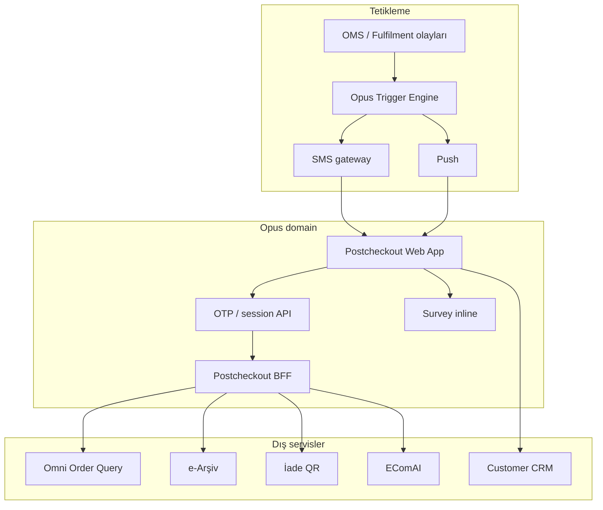

# Opus Omni Postcheckout — Planlama ve Efor

**İş kodu:** MD-014 (P1)  
**Kaynak gereksinim:** [`Documents/Opus/Opus Omni Postcheckout.txt`](Documents/Opus/Opus%20Omni%20Postcheckout.txt)  
**Sahip ekip:** Customer Engagement (Opus) — UI Ersel, Backend Emre  
**Paralel ekipler:** Fulfilment, Customer, CE-AI (EComAI)

---

## Ürün özeti

E-ticaret ve mağaza siparişi **oluştuktan** veya **teslim edildikten** (yapılandırılabilir gecikme) sonra müşteriye **SMS/Push** ile link gönderilir. Müşteri **Opus domain**'inde OTP ile doğrulanmış, modüler bir **Postcheckout** deneyimine girer.

| Modül | API sahibi | UI sahibi |
|-------|------------|-----------|
| OTP + sipariş erişimi | CE Backend | CE UI |
| Anket (admin'den düzenlenebilir) | Opus survey API | CE UI |
| Sipariş özeti + ödeme | **Fulfilment** | CE UI |
| e-Arşiv fatura | **Fulfilment** | CE UI |
| İade QR (e-ticaret ≠ mağaza) | **Fulfilment** | CE UI |
| Kombin önerileri | **EComAI** | CE UI |
| İletişim (WhatsApp / CRM) | **Customer** | CE UI |
| Üye ol / giriş CTA | **Customer** | CE UI |

### Açık karar (Faz 0)

| Konu | Öneri |
|------|--------|
| Anket altyapısı vs özel form | **Opus survey engine** — admin'den düzenlenebilir, impression/complete ölçümü hazır |
| MVP kapsam | TR e-ticaret; mağaza Faz 3 |
| Kritik bağımlılık | Fulfilment **global omni order query** servisi |

---

## Mimari

**Opus'ta yeniden kullanılabilir:** `packages/sdk` (survey, events), `apps/api` (surveyModel, identity, triggers), `apps/admin` (anket/trigger yönetimi).

**Sıfırdan (CE):** Postcheckout SPA, OTP API, BFF proxy, inline survey modu, trigger link şablonları.

---

## Faz planı

### Faz 0 — Keşif (2–3 hafta)

| Çıktı | Sorumlu | Efor |
|-------|---------|------|
| Omni order OpenAPI v0.1 | Fulfilment | 8 PD |
| OTP akış + KVKK/rate limit | CE Backend | 5 PD |
| Anket kararı (Opus survey) | CE + ürün | 2 PD |
| Wireframe + modül feature flags | CE UI | 5 PD |
| Güvenlik: link TTL, token scope | CE + güvenlik | 3 PD |

**Çıkış:** Onaylı API sözleşmesi + ekran wireframe + trigger POC planı.

---

### Faz 1 — MVP TR e-ticaret (8–10 hafta)

| # | İş | CE UI | CE BE | Fulfilment |
|---|-----|-------|-------|------------|
| 1.1 | Trigger: order/delivery → SMS/Push link | — | 5 PD | 3 PD |
| 1.2 | Postcheckout shell (mobil-first) | 12 PD | 3 PD | — |
| 1.3 | OTP giriş + session | 4 PD | 12 PD | — |
| 1.4 | Sipariş özeti modülü | 6 PD | 4 PD | **20 PD** |
| 1.5 | Anket (Opus survey inline) | 6 PD | 8 PD | — |
| 1.6 | Event ölçümü | 2 PD | 3 PD | — |

**CE Faz 1:** ~46 PD · **Fulfilment:** ~23 PD

**MVP çıkış kriteri:** TR e-ticaret siparişi → SMS link → OTP → sipariş özeti + anket tamamlama → Opus admin'de rapor.

---

### Faz 2 — Fatura + İade QR (4–6 hafta)

| İş | CE UI | CE BE | Fulfilment |
|----|-------|-------|------------|
| e-Arşiv görüntüle/indir | 4 PD | 3 PD | 15 PD |
| İade QR e-ticaret | 4 PD | 3 PD | 10 PD |
| İade QR mağaza | 3 PD | 3 PD | 10 PD |
| Kanal UI farkları | 4 PD | 2 PD | — |

**CE:** ~23 PD · **Fulfilment:** ~35 PD

---

### Faz 3 — Kişiselleştirme (4–6 hafta)

| İş | CE UI | CE BE | Diğer |
|----|-------|-------|-------|
| Kombin önerileri | 6 PD | 4 PD | EComAI 15–20 PD |
| İletişim WhatsApp/CRM | 4 PD | 2 PD | Customer 8–12 PD |
| Üye ol / giriş CTA | 3 PD | 2 PD | Customer 5–8 PD |
| Mağaza sipariş parity | 4 PD | 4 PD | Fulfilment 10 PD |

**CE:** ~25 PD

---

### Faz 4 — Üretim (3–4 hafta)

Çoklu ülke/dil, yük testi, UAT, deploy runbook, admin trigger şablonları — **CE ~31 PD**.

---

## Toplam efor özeti

| Ekip | PD (Faz 0–4) |
|------|----------------|
| CE UI (Ersel) | 85–95 |
| CE Backend (Emre) | 75–90 |
| Fulfilment | 90–110 |
| Customer | 15–20 |
| CE-AI | 15–25 |
| QA / güvenlik (paylaşımlı) | 20–30 |

**Takvim:** TR MVP ~11–13 hafta · Full scope ~26–30 hafta (paralel ekipler).

**Kritik yol:** Fulfilment omni order servisi — CE stub ile paralel UI geliştirilebilir.

---

## Sprint backlog — Faz 0 + Faz 1 (Jira-ready)

### Sprint 1 (2 hafta) — Keşif + iskelet

| ID | Görev | Atanan | PD | Bağımlılık |
|----|-------|--------|-----|------------|
| PC-001 | Faz 0 workshop: API alanları, OTP, anket kararı | CE + Fulfilment | 2 | — |
| PC-002 | Postcheckout repo/klasör iskeleti (`Opus/apps/postcheckout`) | Emre | 2 | — |
| PC-003 | Wireframe: OTP → modül layout (mobil) | Ersel | 3 | PC-001 |
| PC-004 | Omni order OpenAPI v0.1 taslağı | Fulfilment | 5 | PC-001 |
| PC-005 | OTP API tasarım doc (TTL, rate limit, token) | Emre | 3 | PC-001 |
| PC-006 | Anket kararı: Opus survey inline onayı | CE + ürün | 1 | PC-001 |

**Sprint 1 çıkış:** Onaylı wireframe + OpenAPI draft + OTP spec.

---

### Sprint 2 (2 hafta) — Shell + OTP mock

| ID | Görev | Atanan | PD | Bağımlılık |
|----|-------|--------|-----|------------|
| PC-101 | Postcheckout shell: routing, layout, modül slotları | Ersel | 5 | PC-003 |
| PC-102 | OTP giriş ekranı (UI) | Ersel | 3 | PC-101 |
| PC-103 | OTP API v1 (send/verify, dev SMS stub) | Emre | 6 | PC-005 |
| PC-104 | Session cookie/JWT + order token binding | Emre | 4 | PC-103 |
| PC-105 | BFF stub: mock order JSON | Emre | 3 | PC-101 |
| PC-106 | Sipariş özeti UI (mock data) | Ersel | 4 | PC-105 |

**Sprint 2 çıkış:** OTP ile mock sipariş özeti uçtan uca (dev).

---

### Sprint 3 (2 hafta) — Fulfilment entegrasyon + anket

| ID | Görev | Atanan | PD | Bağımlılık |
|----|-------|--------|-----|------------|
| PC-201 | Fulfilment omni order API v1 (TR e-ticaret) | Fulfilment | 12 | PC-004 |
| PC-202 | BFF: order proxy + hata eşlemesi | Emre | 4 | PC-201 |
| PC-203 | Sipariş özeti UI → gerçek API | Ersel | 3 | PC-202 |
| PC-204 | Survey inline mod (SDK popup değil) | Ersel | 4 | — |
| PC-205 | Survey API: postcheckout context + submit | Emre | 5 | PC-204 |
| PC-206 | Impression/complete events | Emre | 2 | PC-205 |

**Sprint 3 çıkış:** Gerçek sipariş + anket MVP (staging).

---

### Sprint 4 (2 hafta) — Trigger + MVP kapanış

| ID | Görev | Atanan | PD | Bağımlılık |
|----|-------|--------|-----|------------|
| PC-301 | Trigger: order_created / delivered → link | Emre | 5 | Fulfilment webhook |
| PC-302 | SMS şablon + link builder (order token) | Emre | 3 | PC-301 |
| PC-303 | Admin: postcheckout trigger şablonu | Emre | 4 | PC-301 |
| PC-304 | E2E test senaryosu (TR) | Ersel + Emre | 4 | PC-203, PC-205 |
| PC-305 | Ödeme bilgisi satırı (API varsa) | Ersel + Fulfilment | 4 | PC-201 |
| PC-306 | UAT checklist + SCAN_LOG | CE | 2 | PC-304 |

**Sprint 4 çıkış:** TR e-ticaret MVP demo + UAT hazır.

---

## Opus teknik backlog (CE)

| Öncelik | Madde | Konum / not |
|---------|--------|-------------|
| P0 | `apps/postcheckout` SPA | Yeni uygulama |
| P0 | `POST /api/v1/postcheckout/otp/*` | `apps/api` |
| P0 | BFF routes order/invoice/qr | `apps/api` veya ayrı BFF |
| P0 | Trigger link template | Admin + trigger engine |
| P1 | Inline survey renderer | `packages/sdk` genişletme |
| P1 | Admin survey atama (postcheckout channel) | `apps/admin` |
| P2 | LCW mockup postcheckout sim link | `lcw` (test vitrin) |

---

## Riskler

| Risk | Azaltma |
|------|---------|
| Omni order gecikmesi | BFF mock; Faz 0 OpenAPI kilidi |
| Mağaza/e-ticaret farkı | Modül feature flags |
| OTP abuse | Rate limit, link TTL |
| Anket özel form kararı | Faz 0'da Opus survey ile kilitle |
| KVKK | MD-012 consent; PII minimizasyonu |

---

## Test matrisi (MVP)

| # | Senaryo | Beklenen |
|---|---------|----------|
| T1 | Geçersiz/expired link | Hata ekranı, yeniden OTP yok |
| T2 | OTP yanlış 3x | Rate limit |
| T3 | OTP OK → sipariş özeti | Fulfilment alanları doğru |
| T4 | Anket tamamlama | Opus impression + admin rapor |
| T5 | Trigger gecikmesi (X saat) | Zamanlanmış SMS |
| T6 | Consent yok | Anket/ölçüm davranışı MD-012 uyumlu |

---

## İlişkili iş kodları

| Kod | İlişki |
|-----|--------|
| MD-001 | Opus SDK/events — postcheckout ölçüm |
| MD-012 | Consent — anket ve çerez |
| MD-005 | Site bazlı raporlama (postcheckout site key) |
